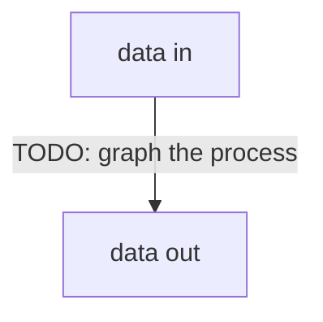

# Architecture

Large part of this was built on faulty premise of day sections being important. In reality they could be used for slight adjustments, but not at all for selecting tasks to execute around. Current [2w-sprints](<https://youtu.be/kZC0J3NVtb4?si=O0KCdQcph7WNkB_H>) model completely undermines large sections of this task-mgmt utils collection, which now should be rewritten.
